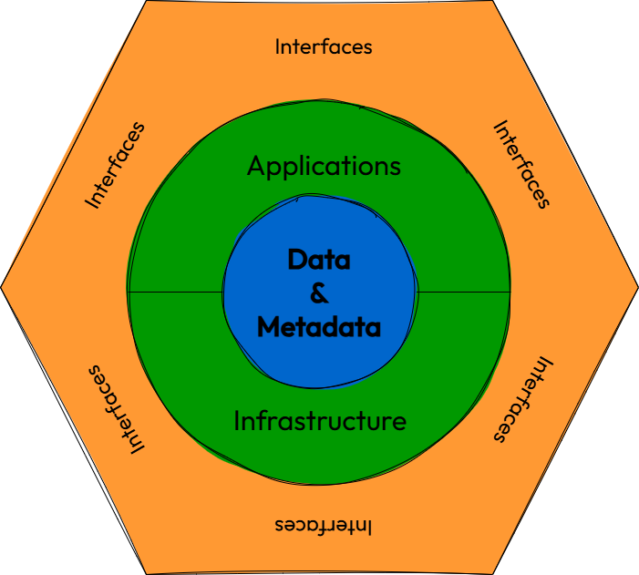

Shield: [![CC BY 4.0][cc-by-shield]][cc-by]

# Data product image
The repository of the data product image used in Wikipedia's definition. 

The image was created by [Andrea Gioia](https://github.com/andrea-gioia) using [draw.io](http://draw.io/). The editable file is [data-product.drawio](data-product.drawio). This repository also contains the image in [PNG](data-product.png) and [SVG](data-product.svg) formats.

# License
This work is licensed under a [Creative Commons Attribution 4.0 International License][cc-by].

[![CC BY 4.0][cc-by-image]][cc-by]

[cc-by]: http://creativecommons.org/licenses/by/4.0/
[cc-by-image]: https://i.creativecommons.org/l/by/4.0/88x31.png
[cc-by-shield]: https://img.shields.io/badge/License-CC%20BY%204.0-lightgrey.svg
